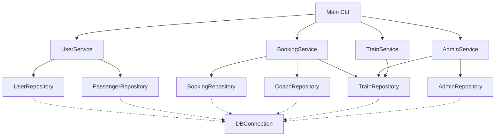
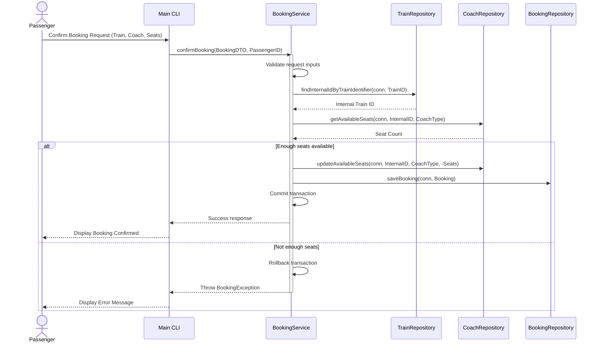
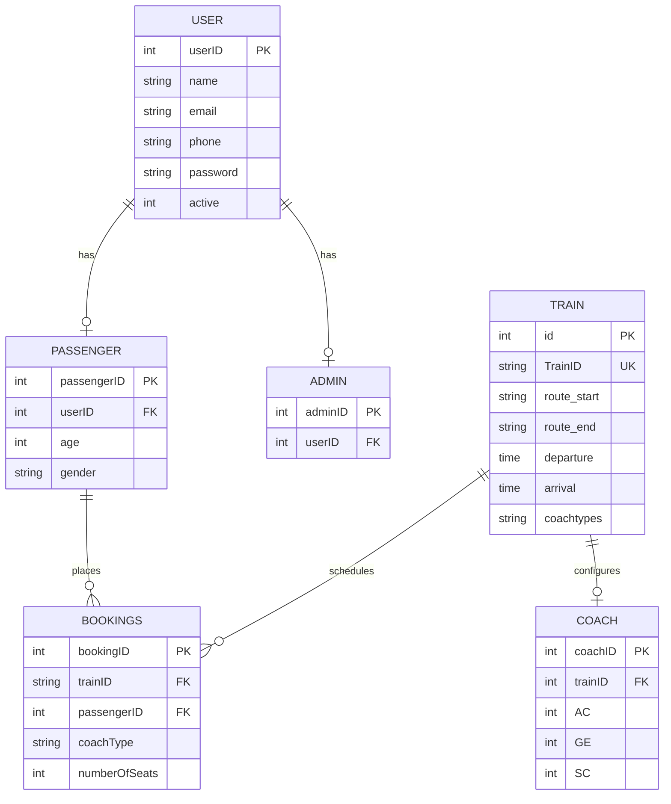

# 🚆 Train Management System

A Java-based application for efficiently managing train operations including scheduling, seat availability, and passenger bookings.

---

## 📑 Table of Contents
- [📘 About](#-about)
- [✨ Features](#-features)
- [🏗️ Layered Architecture](#️-layered-architecture)
- [📂 Folder Structure](#-folder-structure)
- [📦 Dependency Graph](#-dependency-graph)
- [🔄 Sequence Diagram: Ticket Booking](#-sequence-diagram-ticket-booking)
- [🗄️ Database ER Diagram](#️-database-er-diagram)
- [⚙️ Configuration Guide](#️-configuration-guide)
- [🛠️ Build & Execution Instructions](#️-build--execution-instructions)
- [🧪 Testing Guide](#-testing-guide)

---

## 📘 About

The **Train Management System** is a command-line interface (CLI) application built in Java to simulate and manage railway operations. Following a strict **layered architecture**, the system decouples presentation from logic and database interactions. It provides role-based functionality for **administrators** and **passengers** to interact with train schedules, coach capacities, and ticket reservations.

---

## ✨ Features

### 👨‍💼 Admin Panel
- Manage train schedules (departure & arrival)
- Reset and update seat availability (AC, SC, GE coaches)
- Generate detailed reports for trains and bookings
- Secure login/logout functionality

### 👤 Passenger Module
- Register user profiles with hashed password protection (PBKDF2)
- Book and cancel train tickets
- View real-time seat availability
- Manage personal profile
- Secure login/logout system

---

## 🏗️ Layered Architecture

The project enforces a clear separation of concerns using a classic four-tier model:

```
[ Presentation (Main CLI) ]
             ↓
[ Service Layer (Business logic & Transactions) ]
             ↓
[ Repository Layer (Database Queries) ]
             ↓
[ Database (MySQL) ]
```

- **Presentation Layer (`Main.java`)**: Handles CLI interaction, menu displays, user inputs, and output messages. It contains zero SQL and transactions.
- **Service Layer (`com.trainbooking.service.*`)**: Orchestrates business rules, handles transactions (commit and rollback), and manages the lifecycle of database connections.
- **Repository Layer (`com.trainbooking.repository.*`)**: Contains raw SQL execution on standard Connection objects supplied by the services.
- **Model/POJO Layer (`com.trainbooking.model.*`)**: Pure domain models representing objects such as User, Passenger, Admin, Train, Coach, and Booking.

---

## 📂 Folder Structure

The project has been restructured to adhere to the standard Maven directory layout:

```
.
├── pom.xml                      # Maven configuration
├── train_management_schema.sql  # SQL schema database seeds
├── src/
│   ├── main/
│   │   ├── java/
│   │   │   └── com/
│   │   │       └── trainbooking/
│   │   │           ├── Main.java              # CLI entry point
│   │   │           ├── dto/                   # Data Transfer Objects
│   │   │           │   ├── AdminDashboardDTO.java
│   │   │           │   ├── BookingDTO.java
│   │   │           │   ├── TrainDTO.java
│   │   │           │   └── UserDTO.java
│   │   │           ├── exception/             # Custom Exceptions
│   │   │           │   ├── AuthenticationException.java
│   │   │           │   ├── BookingException.java
│   │   │           │   ├── BusinessException.java
│   │   │           │   └── RepositoryException.java
│   │   │           ├── model/                 # Pure POJOs
│   │   │           │   ├── Admin.java
│   │   │           │   ├── Booking.java
│   │   │           │   ├── Coach.java
│   │   │           │   ├── CoachType.java
│   │   │           │   ├── Passenger.java
│   │   │           │   ├── Train.java
│   │   │           │   └── User.java
│   │   │           ├── repository/            # DAOs
│   │   │           │   ├── AdminRepository.java
│   │   │           │   ├── BookingRepository.java
│   │   │           │   ├── CoachRepository.java
│   │   │           │   ├── PassengerRepository.java
│   │   │           │   ├── TrainRepository.java
│   │   │           │   └── UserRepository.java
│   │   │           ├── service/               # Core Logic
│   │   │           │   ├── AdminService.java
│   │   │           │   ├── BookingService.java
│   │   │           │   ├── TrainService.java
│   │   │           │   └── UserService.java
│   │   │           └── util/                  # Helpers
│   │   │               ├── DBConnection.java
│   │   │               ├── PasswordUtils.java
│   │   │               └── Validators.java
│   │   └── resources/
│   │       └── config.properties              # Database config
│   └── test/
│       └── java/
│           └── com/
│               └── trainbooking/
│                   ├── PasswordUtilsTest.java
│                   └── ValidatorsTest.java
```

---

## 📦 Dependency Graph

Below is the dependency map between structural modules:



---

## 🔄 Sequence Diagram: Ticket Booking



---

## 🗄️ Database ER Diagram

The database holds six linked tables:



---

## ⚙️ Configuration Guide

The database properties are loaded dynamically from `/src/main/resources/config.properties`:

```properties
jdbc.driver=com.mysql.cj.jdbc.Driver
db.url=jdbc:mysql://localhost:3306/TrainBookingSystem?useSSL=false
db.user=root
db.password=
db.pool.size=10
```

---

## 🛠️ Build & Execution Instructions

### Prerequisites
- JDK 17 or higher
- Maven 3.6+
- Running MySQL instance with `TrainBookingSystem` schema matching `train_management_schema.sql`

### 1️⃣ Compile the application
```bash
mvn clean compile
```

### 2️⃣ Run the CLI application
Since the application compiles into classes inside target, you can execute it via:
```bash
mvn exec:java -Dexec.mainClass="com.trainbooking.Main"
```

---

## 🧪 Testing Guide

To run the unit tests:
```bash
mvn test
```

Unit tests are written under `src/test/java/com/trainbooking/` targeting non-database utilities (`ValidatorsTest`, `PasswordUtilsTest`) to verify business and security helper behaviors.
